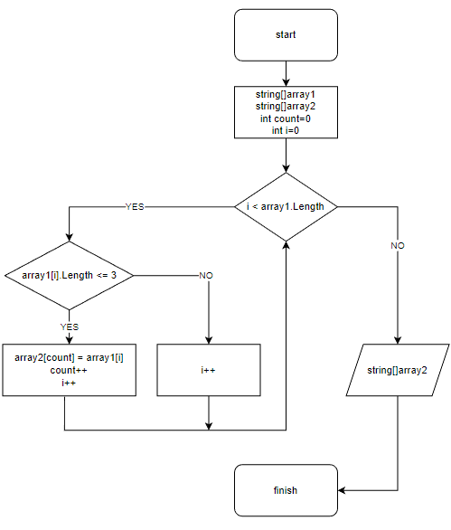

# Итоговая проверочная работа.

## *Задача:*

**Написать программу, которая из имеющегося массива строк формирует массив из строк, длина которых меньше либо равна 3 символа. Первоначальный массив можно ввести с клавиатуры, либо задать на старте выполнения алгоритма. При решение не рекомендуется пользоваться коллекциями, лучше обойтись исключительно массивами**

#### *_Решение выполнено по принципу запроса у пользователя длины массива и значения элементов массива, после чего выполняется следущий метод:_*

`void SearchArrayLength(string[] array1, string[] array2)
{
    int count = default;
    for (int i = 0; i < array1.Length; i++)
    {
        if (array1[i].Length <= 3)
        {
            array2[count] = array1[i];
            count++;
        }
    }
}`

Данный метод заполняет новый массив элементами, удовлетворяющими условиям задачи, после чего выводится в консоль исходный и новый масс ивы.

# Блок-Схема данного метода:

